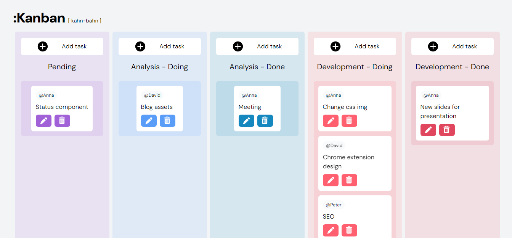

How would your tables and apis change for the following scenarios. What tables and api endpoints would you add? Which tables and api endpoints would need to be updated?
Question 1: If a user can create and edit stages for a particular board. For example instead of Open > In Progress > Done if they want the stages of their task board to be Read > Working > Reviewing > Completed

Answer: According to the current implementation the user has to add a object in our fake Kan-ban data which is the array of objects where each objects represents a space with multiple children in it in the form of array of task ids the stage object will also contain the configuation of the stage such as id name color and limit according to our neccessetiy. For the future and the proccessing we will be having a global state with redux, constext API or jotai according to our need, which will expose funtion for adding a new stage or editing it or doing a crud operations on it, and it's inner components which are the task/blocks.

Question 2: If users can comment on tasks

Answer: if users will comment on the tasks we will modify the fake Kan-ban data with the additional property of comments which will be the arry of objects, where each object will contain the commentor user and comment. which will be displayed with some UI adjustments so that the comments can be collapsed and shown according to a users choice in the UI.

Question 3: How will you do error handling?

Answer: we can use try and catch blocks at the relevant places where the data is being validated.
the most comman way to do it is using try catch block statements
try {
// Code that might throw an error
} catch (error) {
// Handle the error
}

And we can use Global Error Handling
window.onerror = function (message, source, lineno, colno, error) {
// Handle the global error here
};

Please follow the link to follow to the site: https://kan-canva.netlify.app/

